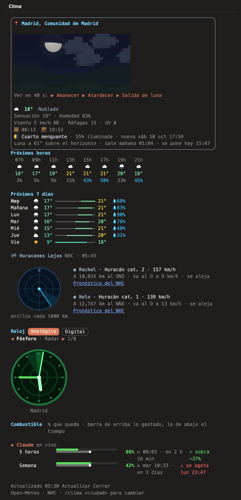
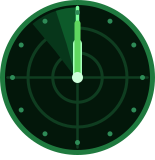
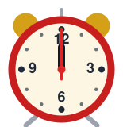
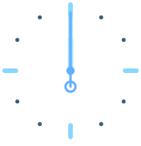
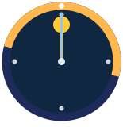
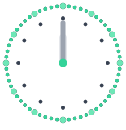
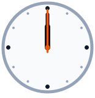

# clima-condor

Un mod para [Claude Code](https://claude.com/claude-code) que abre un panel con el cielo de tu ciudad: clima real, sol y luna en su posición real, marea, huracanes y relojes. Funciona en la terminal y en la pestaña Code de la app de escritorio.

<p align="center">
  
</p>

<p align="center"><sub>El panel con datos reales de Madrid (3 oct 2026, 05:45). Los porcentajes de consumo son de ejemplo.</sub></p>

## Qué muestra

**Cielo vivo.** Amanecer, día, atardecer y noche según la hora real; nubes, lluvia, nieve y tormentas según el clima real. El sol y la luna salen y se ponen detrás del paisaje (desierto, cordillera o colinas, según tu zona) y la luna muestra su fase del día. Con los botones ▶ ves el amanecer, el atardecer o la salida de la luna en 40 segundos.

<table>
  <tr>
    <td></td>
    <td></td>
  </tr>
  <tr>
    <td></td>
    <td></td>
  </tr>
</table>

**Clima ahora.** Temperatura, sensación térmica, humedad, viento y ráfagas, índice UV, salida y puesta del sol.

**Luna.** Fase, porcentaje iluminado, próxima luna llena o nueva, altura sobre el horizonte y cuándo sale y se pone.

**Próximas horas y 7 días.** Temperatura y probabilidad de lluvia cada dos horas; mínima, máxima y lluvia de la semana con barras de rango.

**Marea.** En ciudades con costa cerca: la curva de las próximas 24 horas, pleamar y bajamar.

**Huracanes.** Ciclones activos del Centro Nacional de Huracanes de EE. UU. (NHC) en un radar centrado en ti, con categoría, viento, distancia, rumbo y si se acercan o se alejan. Si uno se acerca, aparece un aviso.

**Relojes.** Analógicos o digitales, con 8 temas; «Dos ciudades» muestra tu hora y la de otra ciudad.

<p>
  
  
  
  
  
  
  
  
</p>

**Combustible.** Cuánto te queda de tus límites de Claude Code (5 horas y semana) y a qué ritmo los gastas, con aviso si se van a agotar antes de renovarse. Si tienes Codex, Grok Build o Antigravity instalados, también los suyos.

**Barra de estado.** El clima en una línea siempre visible, aunque el panel esté cerrado.

Las imágenes del cielo y los relojes salen del mismo código que dibuja el panel (`docs/generar.ts`) y se mueven igual que en la app de escritorio.

## Instalar

```bash
claude plugin marketplace add condor090/clima-condor
claude plugin install clima-condor@condor
```

Abre una sesión nueva de Claude Code y escribe `/clima`.

## Usar

| Comando | Qué hace |
|---|---|
| `/clima` | Abre el panel con tu ubicación (se detecta por tu IP) |
| `/clima Madrid` | El clima de otra ciudad |
| `/clima auto` | Vuelve a tu ubicación |
| `/clima amanecer`, `/clima atardecer`, `/clima luna` | Timelapse de 40 segundos |
| `/clima cerrar` | Cierra el panel |

## Opciones

La segunda ciudad del reloj «Dos ciudades» se cambia en la configuración del plugin:

- `segunda_ciudad`: el nombre que se muestra (por defecto, Santiago)
- `segunda_zona`: su zona horaria IANA (por defecto, `America/Santiago`)

## Privacidad

El mod consulta servicios públicos sin clave: [ipwho.is](https://ipwho.is) para ubicarte por tu IP, [Open-Meteo](https://open-meteo.com) para el clima y la marea, y el [NHC](https://www.nhc.noaa.gov) para los huracanes. Para el panel de consumo lee archivos locales de Codex (`~/.codex`), Grok Build (`~/.grok`) y Antigravity, solo si existen en tu equipo. Nada sale de tu equipo salvo esas consultas.

## Licencia

MIT
